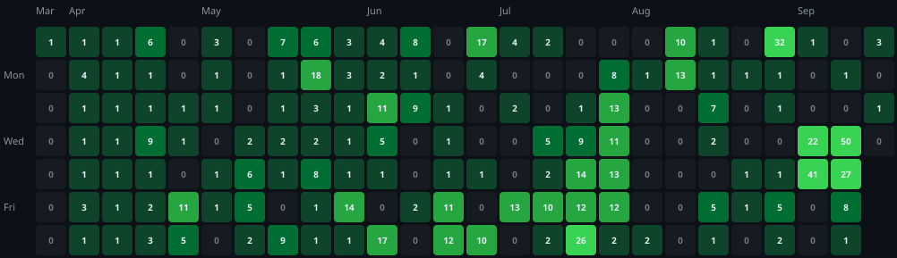

<h1 >Hi, I'm Sriram 👋</h1>

📍 Bengaluru | 🎓 Computer Science Student | 🛠️ Building things with JS & React

  
  
  
  
  
  

---

### 🚀

---

### 🧰 Tech Stack

**Languages:** JavaScript (ES6+), Python  
**Web Dev:** React, React Native, Node.js, Express.js  
**Tools:** Git, GitHub, VS Code, Google Colab

---

### 📊 GitHub Activity

---

### 🌱 What I'm Doing

- Learning and building full-stack 

---

### 📫 Connect

  

